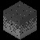
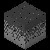

# RISC-V CPU 2x Image Zooming Project

This project implements a 2x image zooming algorithm using a custom RISC-V CPU. The CPU reads a 50x50 grayscale image from memory and creates a 100x100 zoomed version using nearest neighbor interpolation.

## Files

- `proc.v` - Main CPU implementation with all modules
- `test.v` - Testbench to run the simulation
- `run_simulation.v` - Combined file for simulation
- `README.md` - This file

## How it works

1. **Source Image**: 50x50 grayscale pixels stored in memory starting at address 0
2. **Destination Image**: 100x100 grayscale pixels stored in memory starting at address 8192
3. **Algorithm**: Nearest neighbor interpolation - each source pixel is mapped to a 2x2 block in the destination

## Algorithm Details

For each destination pixel (x, y):
- Source pixel = (x/2, y/2)
- Load source pixel value
- Store to destination address = dest_base + y * dest_width + x

## Running the Simulation

To run the simulation using a Verilog simulator (like ModelSim, Icarus Verilog, or Verilator):

```bash
# Using Icarus Verilog
iverilog -o zoom_sim run_simulation.v
vvp zoom_sim

# Using Verilator
verilator --cc run_simulation.v
make -C obj_dir -f Vrun_simulation.mk
./obj_dir/Vrun_simulation
```

## Expected Output

The simulation will:
1. Load the source image from memory addresses 0-2499
2. Process each pixel using the 2x zooming algorithm
3. Store the zoomed image to memory addresses 8192-16191
4. Generate a waveform file `zoom_simulation.vcd` for analysis

## Memory Layout

- **Source Image**: Addresses 0-2499 (50x50 pixels)
- **Destination Image**: Addresses 8192-16191 (100x100 pixels)
- **Instruction Memory**: Addresses 0-16383 (4KB)

## CPU Features

- RISC-V RV32I instruction set
- 32 general-purpose registers
- ALU with arithmetic, logical, and multiplication operations
- Memory interface for 8-bit grayscale pixel data
- Branch and jump instructions for control flow

## Fixed Issues

1. **Instruction Encoding**: Corrected all RISC-V instruction encodings
2. **Register Usage**: Fixed register conflicts and usage patterns
3. **Memory Addressing**: Proper source and destination address calculations
4. **Loop Control**: Corrected branch instruction offsets and conditions
5. **ALU Support**: Added multiplication support for address calculations
6. **Testbench**: Created proper simulation environment 

## Single Cycle Processor Architecture

A **single cycle processor** is a CPU design where each instruction is executed in exactly one clock cycle. This means that all stages of instruction execution (fetch, decode, execute, memory access, and write-back) are completed within a single cycle. The main characteristics are:

- **Simplicity**: All instructions take the same amount of time, making control logic straightforward.
- **No pipelining**: There is no overlap between instructions; each instruction completes before the next begins.
- **Performance**: The clock period must be long enough to accommodate the slowest instruction, which can limit maximum speed.
- **Components**:
  - **Instruction Memory**: Stores program instructions.
  - **Register File**: 32 general-purpose registers for computation.
  - **ALU (Arithmetic Logic Unit)**: Performs arithmetic and logical operations.
  - **Data Memory**: For load/store instructions.
  - **Control Unit**: Generates control signals based on the instruction opcode.

In this project, the single cycle processor implements the RISC-V RV32I instruction set and is responsible for reading the image, performing the zoom operation, and writing the result back to memory.

## RISC-V Instruction Set Overview

The **RISC-V RV32I** is a 32-bit integer instruction set architecture (ISA) that is open and simple. Key features include:

- **Register-Register Operations**: ADD, SUB, AND, OR, XOR, SLT, etc.
- **Immediate Operations**: ADDI, ANDI, ORI, etc.
- **Load/Store**: LB, LH, LW, SB, SH, SW for memory access.
- **Branching**: BEQ, BNE, BLT, BGE, etc. for conditional execution.
- **Jumps**: JAL, JALR for function calls and returns.
- **Shift Operations**: SLL, SRL, SRA for bitwise shifts.
- **Simple Encoding**: Fixed 32-bit instruction width, with fields for opcode, registers, and immediates.

This project uses these instructions to implement loops, memory access, and arithmetic needed for the image zooming algorithm.

## Nearest Neighbour Algorithm (2x Image Zoom) - Detailed Explanation

The **nearest neighbour interpolation** algorithm is a simple method for image scaling. For 2x zoom:

- Each pixel in the source image is mapped to a 2x2 block in the destination image.
- The value of each destination pixel is copied from the nearest source pixel (no averaging or interpolation).

### Mathematical Formulation

Let:
- Source image size: \( W_s \times H_s \) (here, 50x50)
- Destination image size: \( W_d \times H_d \) (here, 100x100)
- For each destination pixel at coordinates \( (x_d, y_d) \):

\[
  x_s = \left\lfloor \frac{x_d}{2} \right\rfloor \\
  y_s = \left\lfloor \frac{y_d}{2} \right\rfloor
\]

- The value of the destination pixel is:

\[
  \text{dest}[y_d][x_d] = \text{src}[y_s][x_s]
\]

- In memory (flattened 2D array):

\[
  \text{src\_addr} = y_s \times W_s + x_s \\
  \text{dest\_addr} = y_d \times W_d + x_d
\]

- For 2x zoom, each source pixel at (x, y) is written to four destination pixels:
  - (2x, 2y), (2x+1, 2y), (2x, 2y+1), (2x+1, 2y+1)

### Example
- Source pixel at (10, 20) maps to destination pixels (20, 40), (21, 40), (20, 41), (21, 41).

### Why Nearest Neighbour?
- **Fast**: Only requires integer arithmetic (no division or floating point).
- **Simple**: Easy to implement in hardware and software.
- **Drawback**: Can produce blocky or pixelated images, but is ideal for simple zooming tasks.

## RISC-V Assembly Code for 2x Image Zoom (with Explanations)

```assembly
addi x5, x0, 0        # x5 = src_base = 0 (source image base address)
addi x10, x0, 2047    # x10 = 2047
addi x10, x10, 2047   # x10 = 4094
addi x10, x10, 2047   # x10 = 6141
addi x10, x10, 2047   # x10 = 8188
addi x10, x10, 4      # x10 = 8192 (dest_base, destination image base address)
addi x7, x0, 50       # x7 = src_width = 50
addi x8, x0, 100      # x8 = dest_width = 100
addi x9, x0, 0        # x9 = dest_row = 0

# row_loop:
addi x6, x0, 0        # x6 = dest_col = 0

# col_loop:
srai x14, x9, 1       # x14 = dest_row >> 1 (src_row)
srai x15, x6, 1       # x15 = dest_col >> 1 (src_col)
mul x14, x14, x7      # x14 = src_row * src_width
add x15, x14, x15     # x15 = src_row*src_width + src_col
add x14, x15, x5      # x14 = src_addr = src_base + ...
lb x13, 0(x14)        # x13 = mem[src_addr] (load source pixel)
mul x15, x9, x8       # x15 = dest_row * dest_width
add x15, x15, x6      # x15 = dest_row*dest_width + dest_col
add x15, x15, x10     # x15 = dest_addr
sb x13, 0(x15)        # mem[dest_addr] = x13 (store pixel to destination)
addi x6, x6, 1        # x6++ (next dest_col)
blt x6, x8, col_loop  # if dest_col < dest_width, repeat col_loop

addi x9, x9, 1        # x9++ (next dest_row)
blt x9, x8, row_loop  # if dest_row < dest_width, repeat row_loop

jal x0, 0             # halt (infinite loop)
```

### Step-by-Step Explanation

1. **Initialization**
   - `x5` is set to 0, marking the start of the source image in memory.
   - `x10` is calculated to be 8192, the base address for the destination (zoomed) image.
   - `x7` and `x8` are set to 50 and 100, the source and destination image widths.
   - `x9` is initialized to 0, representing the current destination row.

2. **Outer Loop (Rows)**
   - `x6` is set to 0 at the start of each row (destination column index).

3. **Inner Loop (Columns)**
   - `x14` gets the source row index by shifting `x9` (dest_row) right by 1 (divide by 2).
   - `x15` gets the source column index by shifting `x6` (dest_col) right by 1.
   - `x14` is multiplied by the source width to get the row offset in memory.
   - `x15` is added to `x14` to get the full source pixel index.
   - `x14` is added to `x5` (src_base) to get the absolute source address.
   - The source pixel is loaded into `x13`.
   - The destination address is calculated: `x9 * dest_width + x6 + dest_base`.
   - The pixel value is stored at the destination address.
   - `x6` (dest_col) is incremented.
   - If `x6` is less than `x8` (dest_width), the inner loop repeats.

4. **Row Increment**
   - After finishing a row, `x9` (dest_row) is incremented.
   - If `x9` is less than `x8` (dest_width), the outer loop repeats.

5. **Halt**
   - The program halts by jumping to itself.

---

This code implements the 2x nearest neighbour zoom by copying each source pixel to a 2x2 block in the destination image.

## Input vs Output Comparison

| Input Image (50x50) | Output Image (100x100, 2x Zoomed) |
|---------------------|------------------------------------|
|  |  |

The left image is the original 50x50 grayscale input. The right image is the 2x zoomed output generated by the RISC-V CPU using nearest neighbour interpolation.

## RISC-V RV32I Instruction Set Reference

Below is a reference image for the RISC-V RV32I instruction set:


This diagram provides an overview of the supported instructions and their encoding formats.

### RISC-V RV32I Instruction Set: Explanation

The RISC-V RV32I instruction set is divided into several categories, each serving a specific purpose in the CPU's operation:

- **Arithmetic Instructions**: `ADD`, `SUB`, `ADDI`, etc. Used for integer addition, subtraction, and immediate arithmetic. Essential for address calculations, loop counters, and pixel value manipulation.
- **Logical Instructions**: `AND`, `OR`, `XOR`, `ANDI`, `ORI`, etc. Used for bitwise operations, often in masking and control logic.
- **Shift Instructions**: `SLL`, `SRL`, `SRA`, and their immediate forms. Used for efficient multiplication/division by powers of two, and for bit manipulation.
- **Load/Store Instructions**: `LB`, `LH`, `LW`, `SB`, `SH`, `SW`. Used to move data between registers and memory. In this project, these are crucial for reading pixel values from the source image and writing to the zoomed image.
- **Branch Instructions**: `BEQ`, `BNE`, `BLT`, `BGE`, etc. Used for conditional execution and loop control, allowing the CPU to repeat operations or skip instructions based on register values.
- **Jump Instructions**: `JAL`, `JALR`. Used for function calls, returns, and unconditional jumps, supporting structured program flow.
- **Set Instructions**: `SLT`, `SLTI`, etc. Used to compare values and set registers based on the result, often for implementing conditional logic.

#### How These Instructions Are Used in This Project
- **Loops**: Branch and arithmetic instructions implement the nested loops for iterating over image rows and columns.
- **Pixel Access**: Load and store instructions fetch source pixel values and write zoomed pixel values to memory.
- **Address Calculation**: Arithmetic and shift instructions compute memory addresses for both source and destination images.
- **Control Flow**: Branch and jump instructions manage the main program flow, including loop exits and function calls.

This combination of instructions allows the single cycle processor to efficiently perform the 2x nearest neighbour image zooming algorithm entirely in hardware. 
